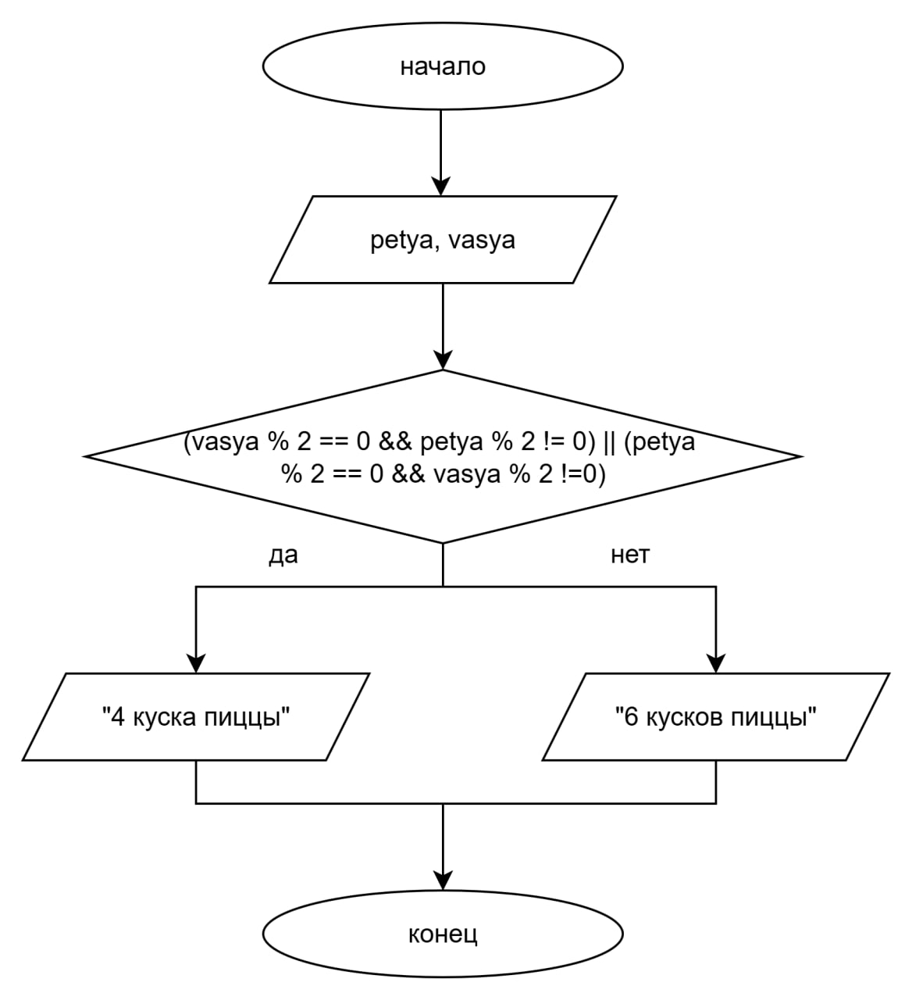

# Домашнее задание к работе 4

## Условие задачи
Дележка пиццы
Друзья заказали пиццу. Они решат, резать ее на 4 или 6 кусков, по простому правилу: если ровно один из них (Ваня A или Петя B) 
проголодался (его "уровень голода" - четное число), то резать на 4 части. Запишите условие для нарезки на 4 части.

## 1. Алгоритм и блок схема

### Алгоритм 
1. Начало
2. Инициализировать переменные:
   * 'vasya' - переменная для хранения информации о том, голоден ли Вася А
   * 'petya' - переменная для хранения информации о том, голоден ли Вася А
3. Считать значения переменных 'vasya' и 'petya'
4. Если выполняется условие ('vasya' % 2 == 0 && 'petya' % 2 != 0) || ('petya' % 2 == 0 && 'vasya' % 2 !=0), вывести "Следует порезать пиццу на 4 куска"
   Иначе вывести "Следует порезать пиццу на 6 кусков"
5. Конец

### Блок-схема

