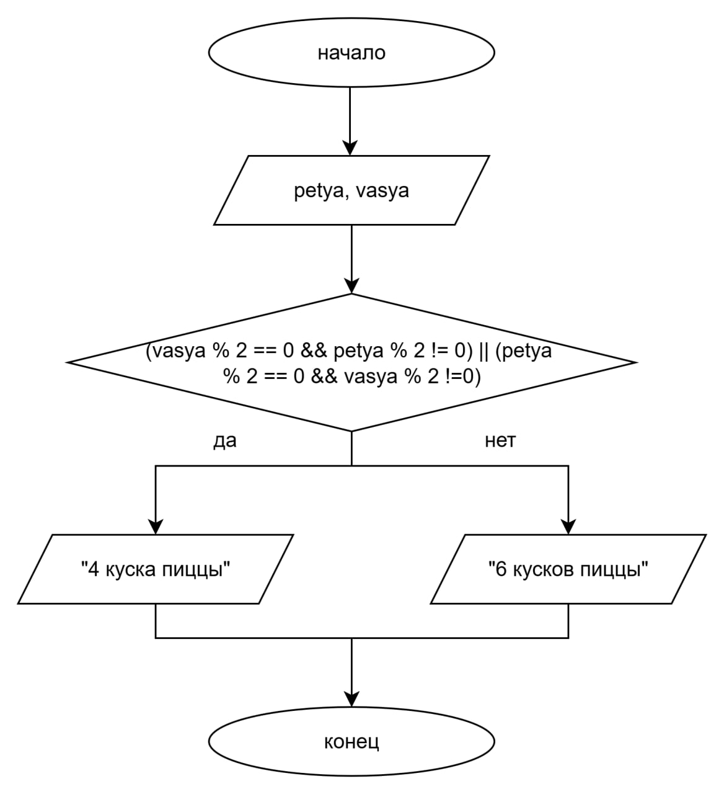

# Домашнее задание к работе 4

## Условие задачи
Дележка пиццы
Друзья заказали пиццу. Они решат, резать ее на 4 или 6 кусков, по простому правилу: если ровно один из них (Ваcя A или Петя B) 
проголодался (его "уровень голода" - четное число), то резать на 4 части. Запишите условие для нарезки на 4 части.

## 1. Алгоритм и блок схема

### Алгоритм 
1. Начало
2. Инициализировать переменные:
   * 'vasya' - переменная для хранения информации о том, голоден ли Вася А
   * 'petya' - переменная для хранения информации о том, голоден ли Вася А
3. Считать значения переменных 'vasya' и 'petya'
4. Если выполняется условие ('vasya' % 2 == 0 && 'petya' % 2 != 0) || ('petya' % 2 == 0 && 'vasya' % 2 !=0), вывести "Следует порезать пиццу на 4 куска"
   Иначе вывести "Следует порезать пиццу на 6 кусков"
5. Конец

### Блок-схема

[Ссылка на draw.io](https://viewer.diagrams.net/?tags=%7B%7D&lightbox=1&highlight=0000ff&edit=_blank&layers=1&nav=1&title=%D0%94%D0%B8%D0%B0%D0%B3%D1%80%D0%B0%D0%BC%D0%BC%D0%B0%20%D0%B1%D0%B5%D0%B7%20%D0%BD%D0%B0%D0%B7%D0%B2%D0%B0%D0%BD%D0%B8%D1%8F.drawio.html&dark=auto#R%3Cmxfile%3E%3Cdiagram%20name%3D%22%D0%A1%D1%82%D1%80%D0%B0%D0%BD%D0%B8%D1%86%D0%B0%20%E2%80%94%201%22%20id%3D%22JWOss_fssRCe1sx4QKWD%22%3E7VnJbtswEP2WHgS0hxZavRxjO13QBQFSoO2RsRiJDSWqFB1b%2BfoOpZG1UKmT1EmcpoBBkENyhnxvhkPRljdPNu8kyeLPIqTccu1wY3kLy3Unjg%2BlFhSVIBhPKkEkWViJnEZwyq4oCm2UrlhI885AJQRXLOsKlyJN6VJ1ZERKse4OOxe8azUjETUEp0vCTek3FqoYt%2BWOG%2Fl7yqK4tuyMplVPQurBuJM8JqFYt0TeseXNpRCqqiWbOeUauxqXat7ba3q3C5M0VTeZ8KFIz84vfn4JgpPg6kJ89b98%2F%2FgatVwSvsINWwvbmi3K0rYWjjUZ13UoZ2V5jBtSRY0SWAJCoDFbx0zR04wsdc8aXAJksUo4tByoojkqFd1cuw9niw54FRUJVbKAITjB83AKepSP%2BK4bepzRqJLFLWrqcQQ9ItpqbkCDCuJ2CwzdYQyPEKsGz6DEc3RY6D06fJ4JnwFQGh7pWIbWkpM8Z8suLlKs0pBqI%2FYWJRoagb0ToxYGgW1CUMsk5USxy676IVzQwolgYHhLge94HQomPWRzsZJLipPaAb1Dj%2BP2FCkiI6oMRSVL213fnTjfIC6jqiCWOy%2Blua72iIQzMNNV4IJwTrmIJEmAsoxKBsuhst930nTsCo5ztqF1AtlbsPjDCHeCZcBT7i1YJs8vWHoUjO4cLV1Frv2w0eJMTaYA9VNsCqliEYmU8ONG2uOqGfNJiAzp%2FEmVKtDtyUqJLtl0w9R3Pf1NgK0frZ7FBjWXjeKWLgF7KbH%2Fw6anw67zlz7h1dQhlV4%2F3K6hEsKCFK1hmR6Q39z3arvXuZixru54qFQr2Ktfba%2BXB%2B9X4D2yaE3SzR%2FtvmZa2Xoy%2Fhj4h%2BmPxroewh%2BnRoZ6iXcBMB5AqXt1h%2B7TC4LfiCQ6mVel0bTxWtGa%2FwJnv9LS8Vz%2FXPsljsPp6VmO6jh4ySxkl1CNVCm62zrMfeh16EVUJgCvjpVeWMpYJGerfPdNhnAWpTp9g3%2BXN589XGVcfzqc%2Flpp3PMG8nj%2Fdrq%2Fz6aBq8vzPLj2fiD1Dwr%2FhgfS7ox2w2%2BV255sfTv%2BjpPN2OCDZFr%2Fv8MeusMaKe%2BeHLZv5zAdNjByMSSnXyv94jjzdSLDdyrHmnhl6bRerux6wNuynODjVVPOGmVGYDyxD%2F3tI23%2FBvdoH%2Fr1A%2FMgd6Nd3FWvju4zYtAfHRyDA281mga%2Fjq4e4LB3teMeqBFiS8KPsCNhYVhlGZqzK3JWqtIHOR5foDeYWcFC64LEkjeI50qKCzoXXGgeU5HSkhbOe6I9MOP1Yssdm8z4A8R490aM%2BYliPNKbd9N%2FlR5%2F8mD0QLP5u6tKcs1%2Fht7xbw%3D%3D%3C%2Fdiagram%3E%3C%2Fmxfile%3E)

## 2. Реализация программы 
#define _CRT_SECURE_NO_DEPRECATE
#include <stdio.h>
#include <locale.h>

int main()
{

	setlocale(LC_CTYPE, "RUS");
	int vasya, petya;
	puts("ДЕЛЁЖКА ПИЦЦЫ");
	puts("_____________");
	puts("Вася А проголодался? (0 - да, 1 - нет)");
	scanf("%d", &vasya);
	puts("Петя В проголодался? (0 - да, 1 - нет)");
	scanf("%d", &petya);
	if ((vasya % 2 == 0 && petya % 2 != 0) || (petya % 2 == 0 && vasya % 2 !=0)) puts("Следует порезать пиццу на 4 куска");
	else puts("Следует порезать пиццу на 6 кусков");
	return 0;

}

## 3. Результаты работы программы:

### Если голоден только Вася А:
ДЕЛЁЖКА ПИЦЦЫ
_____________
Вася А проголодался? (0 - да, 1 - нет)
0
Петя В проголодался? (0 - да, 1 - нет)
1
Следует порезать пиццу на 4 куска

### Если голоден только Петя В:
ДЕЛЁЖКА ПИЦЦЫ
_____________
Вася А проголодался? (0 - да, 1 - нет)
1
Петя В проголодался? (0 - да, 1 - нет)
0
Следует порезать пиццу на 4 куска

### Если они оба проголодались:
ДЕЛЁЖКА ПИЦЦЫ
_____________
Вася А проголодался? (0 - да, 1 - нет)
0
Петя В проголодался? (0 - да, 1 - нет)
0
Следует порезать пиццу на 6 кусков

### Если никто из них не голоден:
ДЕЛЁЖКА ПИЦЦЫ
_____________
Вася А проголодался? (0 - да, 1 - нет)
1
Петя В проголодался? (0 - да, 1 - нет)
1
Следует порезать пиццу на 6 кусков

## 4. Информация о разработчике:
Вильальба Агния, группа бТИИ251
